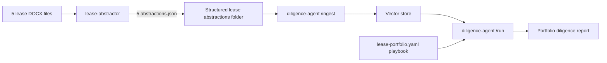

# Combine Two Agents: Lease Portfolio Diligence

> **Bonus module.** Prerequisites: you've completed [module 02 (lease-abstractor)](../02-build-first-agent) and [module 04 (diligence-agent)](../04-build-third-agent).

Building one agent is a demo. Composing two is a system. This module walks through a real composition: use `lease-abstractor` to turn a folder of raw lease documents into structured JSON abstractions, then feed those abstractions into `diligence-agent` to answer portfolio-level diligence questions.

This is what a professional AI workflow looks like — small, single-purpose agents chained by structured data, not by conversation.

## The scenario

You're evaluating a portfolio of 5 commercial retail leases for an acquisition. Each lease is a 20-40 page DOCX. You want to answer:

1. Which leases have below-market rent escalations?
2. Which leases have unusually broad tenant assignment rights?
3. Which leases are within 18 months of expiration and lack a renewal option?
4. What's the aggregate risk score of the rent roll?

You could read all 5 leases yourself. That's 4-6 hours. You could paste them into Claude and hope. That's a 45-minute chat that produces something you can't verify.

Instead, chain the two agents.

## Architecture



Every arrow between agents is a **structured JSON handoff** — never a natural-language summary. That's the design principle. When one agent's output is another agent's input, use a schema.

## Step 1: Batch-abstract the portfolio

Fork or clone `lease-abstractor`. Add a script that walks a folder, runs each DOCX through the abstractor, and writes each result to `abstractions/<filename>.json`.

```bash
# In your lease-abstractor clone:
mkdir -p scripts
cat > scripts/batch-abstract.ts <<'EOF'
import { readdir, readFile, writeFile, mkdir } from 'node:fs/promises';
import { join, basename, extname } from 'node:path';
import { abstractLease } from '../src/lib/abstractor.js';
import { parseDocx } from '../src/lib/docx-parser.js';

const inputDir = process.argv[2] ?? './portfolio';
const outputDir = process.argv[3] ?? './abstractions';

await mkdir(outputDir, { recursive: true });
const files = (await readdir(inputDir)).filter((f) => f.endsWith('.docx'));

for (const file of files) {
  console.log(`[abstract] ${file}`);
  const buffer = await readFile(join(inputDir, file));
  const text = await parseDocx(buffer);
  const result = await abstractLease(text);
  const outFile = join(outputDir, `${basename(file, extname(file))}.json`);
  await writeFile(outFile, JSON.stringify(result.abstraction, null, 2));
  console.log(`  → ${outFile}  (${result.tokens_used} tokens, $${result.cost_estimate.toFixed(2)})`);
}

console.log(`Done. ${files.length} leases abstracted.`);
EOF

npx tsx scripts/batch-abstract.ts ./portfolio ./abstractions
```

You now have 5 files: `abstractions/lease-1.json`, `abstractions/lease-2.json`, etc.

Total cost: ~$0.15-0.30 per lease with Sonnet 4. Portfolio of 5: about $1.

## Step 2: Write a portfolio playbook

In your `diligence-agent` clone, create `playbooks/lease-portfolio.yaml`:

```yaml
name: Lease Portfolio Diligence
version: 1.0
description: Portfolio-level review of commercial lease abstractions produced by lease-abstractor.
variables:
  target_property_type: retail

items:
  - id: below_market_escalation
    title: Below-market rent escalations
    question: |
      Identify any lease with a base-rent escalation clause of less than 2.5% per year.
      For each, report the tenant, the escalation rate, the years-remaining, and the
      dollar impact of the below-market escalation vs a 3% market benchmark.
    evaluation_criteria: |
      GREEN if all leases escalate at 2.5% or more.
      YELLOW if 1-2 leases are below-market with impact under $10k/year each.
      RED if 3+ leases below-market or aggregate impact exceeds $30k/year.

  - id: broad_assignment_rights
    title: Broad tenant assignment rights
    question: |
      For each lease, describe the tenant's assignment and subletting rights.
      Flag any lease where the tenant may assign without landlord consent, or where
      landlord consent "shall not be unreasonably withheld" without a defined standard.
    evaluation_criteria: |
      GREEN if all leases require landlord consent with a workable standard.
      YELLOW if 1 lease has a soft standard.
      RED if 2+ leases allow assignment without meaningful consent.

  - id: expiring_no_renewal
    title: Expiring leases without renewal option
    question: |
      List every lease expiring within 18 months of today. For each, note whether
      the tenant has an unexercised renewal option and the notice deadline.
    evaluation_criteria: |
      GREEN if all expiring leases have renewal options.
      YELLOW if 1 expiring lease has no renewal.
      RED if 2+ expiring leases have no renewal, especially anchor/large-RSF tenants.

  - id: personal_guarantees
    title: Personal-guarantee coverage
    question: |
      For each lease, confirm whether there's a personal guaranty and, if so, whether
      it's full-recourse, limited (specify cap), or good-guy-only.
    evaluation_criteria: |
      GREEN if all high-risk tenants (new entities, sub-$1M revenue) have full guaranties.
      YELLOW if 1 borderline case.
      RED if a major tenant has no guaranty.

  - id: co_tenancy
    title: Co-tenancy clauses
    question: |
      Identify any co-tenancy clauses that permit rent reduction or termination if
      an anchor or occupancy threshold is not met. Report the specific triggers.
    evaluation_criteria: |
      GREEN if no co-tenancy exposure or only minor triggers.
      YELLOW if 1 lease has a rent-reduction trigger with material exposure.
      RED if any lease has a termination-right co-tenancy clause tied to a currently-vacant anchor.
```

## Step 3: Ingest and run

```bash
# In your diligence-agent clone:
export DILIGENCE_DATA_ROOT=/path/to/lease-abstractor/abstractions
make ingest DATA_ROOT=$DILIGENCE_DATA_ROOT

make run-diligence PLAYBOOK=lease-portfolio OUTPUT=./reports/portfolio-2026-08.html
```

Open the report. Every finding cites the specific lease JSON file it drew from, and every JSON file traces back to the original lease abstraction's section citations.

## What you just built

You now have a repeatable workflow. Point it at any 5 leases, any 50 leases. The playbook is data. The agents are the same. The output is a diligence report you can hand to a lawyer or partner with confidence because every claim traces back to a citation in a specific document.

This is the shape of professional AI systems: **small agents, structured handoffs, evaluable outputs**.

## Extensions

- **Add a third agent.** Use the [belle-mcp-server](../05-mcp-server) to pull current market comps from your Supabase, feed them into a new "market-vs-lease" diligence item.
- **Regression eval the whole chain.** Save an expected-findings.json for a known portfolio. Add to CI. Now you know when a model update degrades your pipeline before it hits production.
- **Turn it into a service.** Wrap the two-step chain in a FastAPI endpoint that takes a folder path and returns a report URL. Deploy on Railway.

## What this teaches

- **Structured data is the API between agents.** Never chain agents with natural-language summaries.
- **Small single-purpose agents compose. Big do-everything agents don't.** Each of these two agents can be tested, evaluated, and swapped independently.
- **Cost is predictable.** ~$1 per portfolio pass, deterministic per-lease.
- **Every conclusion is auditable.** The report → JSON abstraction → source lease citation chain never breaks.

## Related

- [Original module 02 — lease-abstractor](../02-build-first-agent)
- [Original module 04 — diligence-agent](../04-build-third-agent)
- [Repos overview](../../repos/README.md)
